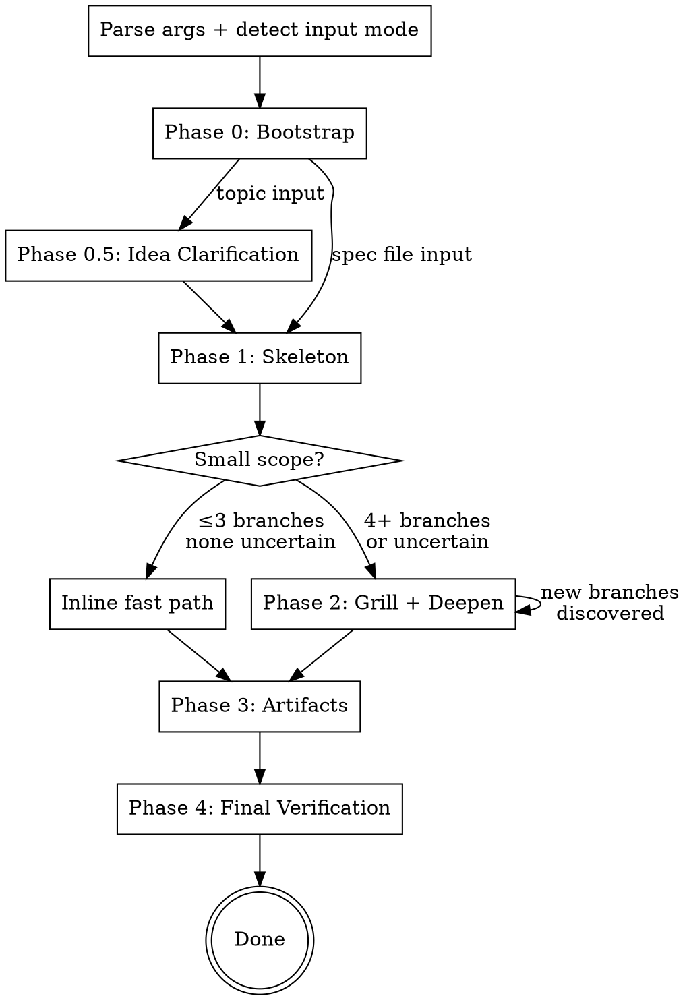

# Auto Plan

Autonomous planning skill. Builds a contextual model of the user's preferences, auto-answers grilling questions where confident, prompts only when genuinely uncertain, and produces fully-grilled design artifacts.

## Overview



## Configuration

**Invocation:** `/auto-plan <topic or spec-path> [--flags]`

| Flag | Default | Description |
|------|---------|-------------|
| `--max-iterations` | `5` | Maximum grill-deepen cycles |
| `--max-depth` | `3` | Maximum branch nesting levels |
| `--confidence-threshold` | `medium` | `low` (fully autonomous), `medium`, `high`, `paranoid` (ask everything) |
| `--domains` | auto | Override domain detection (e.g., `--domains backend,infra`) |
| `--skip-plan` | off | Stop after spec + ADRs |
| `--plan-only` | off | Skip grilling, produce plan from existing spec. Requires spec file input. |
| `--auto-commit` | off | Commit artifacts without asking |
| `--dry-run` | off | Show skeleton + branches only |
| `--resume` | off | Continue interrupted session from state file |
| `--redo` | — | Change a decision (e.g., `--redo "use SQLite instead of PostgreSQL"`) |
| `--harden` | off | Run the hardening meta-loop: re-examine artifacts across fresh-context passes until convergence (Phase 5). |
| `--max-passes` | `3` | Maximum hardening passes. Distinct from `--max-iterations` (in-pass grill cycles). |
| `--unattended` | off | Suppress user prompts; bubble-up questions degrade to `UNRESOLVED` so the loop never blocks. |

**Phase matrix:**

| Mode | Phases | Output |
|------|--------|--------|
| Default | 0 → 0.5 → 1 → 2 → 3 → 4 | CONTEXT.md, spec, ADRs, plan |
| `--skip-plan` | 0 → 0.5 → 1 → 2 → 3 → 4 | CONTEXT.md, spec, ADRs |
| `--plan-only` | 0 → 3 → 4 | plan |
| `--dry-run` | 0 → 0.5 → 1 | nothing (shows skeleton) |
| `--resume` | load state → continue | remaining artifacts |
| `--redo` | load state → 2 → 3 → 4 | updated artifacts |
| `--harden` | 0 → … → 4, then Phase 5 loop | artifacts + convergence CSV/PNG + report |

## Input Mode Detection

- If args resolve to an existing `.md` file on disk → **spec file input** (skip Phase 0.5, use as skeleton)
- Otherwise → **topic string input** (full flow including Phase 0.5)

**File collision handling:** Before writing artifacts, check for existing files:
- State file exists for same topic → ask "resume or start fresh?"
- Completed artifacts exist, no state file → ask "overwrite or create -v2?"
- Nothing exists → proceed

**`--plan-only` with UNRESOLVED markers:** If the spec contains `UNRESOLVED:` markers, list them and offer: (a) plan with BLOCKED tasks, (b) resolve first, (c) abort.

## Phase 0: Bootstrap

1. Read all preference sources:
   - Claude Code memory files (`~/.claude/projects/.../memory/`)
   - CONTEXT.md, ADRs in `docs/adr/`
   - CLAUDE.md
   - Workbench APIs: `GET /api/memory/facts` (best-effort, skip if unavailable)

2. Detect domain(s) from the topic. Domain vocabulary is open: `backend`, `frontend`, `infrastructure`, `data-ml`, `devops`, `api-design`, `observability`, etc. Show detected domains in output. Override with `--domains` flag.

3. Load domain-tagged preferences. If a domain has no stored preferences, ask 2-3 calibration questions (batched), save answers as domain-tagged feedback memories.

4. If invoked mid-conversation, scan the **last 10 messages** for context relevant to the planning topic. Ignore unrelated messages.

5. Compile the **user model brief** (~1000 tokens):

```
## User Model Brief

### Base Preferences
- [3-5 bullets from base feedback memories]

### Domain Preferences: {domain}
- [2-3 bullets per detected domain]

### Active Constraints
- [from CLAUDE.md and relevant ADRs]

### Correction Patterns
- [things the user has corrected in past sessions]

### Session Directives
- [from explicit args and conversation context]
```

**Output:** `[auto-plan] Phase 0: loaded N memories, N ADRs, detected domains: x, y`

## Phase 0.5: Idea Clarification (topic input only)

**Skipped when:** input is a spec file, or `--plan-only` is set.

**Confidence override:** Always `very-high` regardless of `--confidence-threshold`. Only auto-answer when memory/ADR/CLAUDE.md explicitly covers the question. Everything else gets asked.

1. Scan last 10 messages for context already discussed
2. Identify what's unclear: purpose, constraints, success criteria, scope boundaries, trade-offs
3. Auto-answer from user model (only `very-high` confidence matches)
4. Ask remaining questions **one at a time** until confident
5. If the design space is open, propose 2-3 architectural approaches with trade-offs and recommendation
6. **Exit condition:** you can write a one-paragraph summary of what's being built and why. Confirm with the user.

**Scope decomposition:** If the topic describes 4+ independent subsystems, suggest decomposition with natural seams. Plan one sub-project at a time. User re-invokes for the rest.

**Output:** `[auto-plan] Phase 0.5: idea clarification — N questions answered, N asked`

## Phase 1: Skeleton

1. Produce a high-level spec outline: section headings, key decisions, scope boundaries
2. If input is an existing spec, extract branches from its sections
3. If invoked mid-conversation, distill conversation context into the topic description and user model brief
4. Identify **branches** — each design decision or section needing exploration. Target 5-15 grilling questions per branch. Split sections with 30+ decisions into sub-branches.
5. Assign confidence:
   - `known` — ADR/memory covers it
   - `likely` — can auto-answer from domain principles
   - `uncertain` — needs a Griller sub-agent
6. Do a broad codebase survey (read key files, or dispatch a Researcher) to produce a **codebase context summary** (~1000 tokens)

**Small scope fast path:** If ≤3 branches and none `uncertain`, handle grilling inline — no sub-agents. Still follow the grill-with-docs protocol, still produce artifacts.

**Output:** `[auto-plan] Phase 1: skeleton has N branches (N known, N likely, N uncertain)`

## Phase 2: Grill + Deepen

**Loop until:** no `uncertain` branches remain AND no unresolved questions, OR `--max-iterations` hit.

### Dispatching Grillers

For each `uncertain` or `likely` branch, spawn a Griller sub-agent via the Agent tool:

```
Agent({
  description: "Grill: {branch topic}",
  prompt: [assembled from below],
  model: "opus"
})
```

**Griller prompt assembly:**
1. Task brief: "You are grilling the '{branch topic}' branch of this design. Follow the Griller Protocol below."
2. Read and paste contents of `GRILLER-PROTOCOL.md` from this skill's directory
3. Read and paste contents of `GRILLER-RESPONSE-TEMPLATE.md` from this skill's directory
4. User model brief (~1000 tokens)
5. Full CONTEXT.md content
6. Curated codebase context for this branch (relevant file excerpts only)
7. Settled decisions as constraints: "These decisions are settled. Do not re-decide them: [list]"

**Parallel dispatch strategy:**
- First iteration: dispatch all branches in parallel (can't predict overlap upfront)
- Subsequent iterations: sequence branches that touched the same types/interfaces in prior rounds. Truly independent branches stay parallel.

### Collecting Results

After Grillers return, the orchestrator:

1. **Reads each response** holistically (structured by the response template, not brittle parsing)
2. **Accepts** high-confidence auto-answers → fold into decision log
3. **Shows** medium-confidence auto-answers to the user with rationale → batch-confirm
4. **Prompts** for unresolved questions (batched, with recommendations):
   ```
   I have N questions I couldn't resolve from your preferences:

   1. [Topic] I'd pick: [answer]. Reasoning: [why]. Agree?
   2. [Topic] Genuinely uncertain — two approaches:
      a) [option A]
      b) [option B]
      Which do you prefer?
   ```
5. **Saves** user corrections as domain-tagged feedback memories immediately
6. **Adds** discovered new branches to the queue
7. **Fetches** requested files (from Files Needed sections) — reads directly if path is known, dispatches a Researcher if open-ended
8. **Detects conflicts** across parallel Grillers — contradictory decisions become a new branch

### Conflict Resolution

Three layers:
1. **Prevention:** settled decisions passed as constraints to every Griller
2. **Detection:** post-collection scan for contradictions. Conflicting decisions → new branch in next iteration.
3. **Sequencing:** branches that overlapped in prior rounds get sequenced in subsequent iterations

### Researcher Sub-Agents

When a Griller needs codebase context the orchestrator didn't anticipate, or when the orchestrator needs to answer a factual question:

- **Known file path** → orchestrator reads directly (no sub-agent)
- **Open-ended exploration** → dispatch a Researcher:

```
Agent({
  description: "Research: {question}",
  prompt: "Explore the codebase to answer: {question}. Use whatever search and exploration tools are available. Return findings as structured facts.",
  model: "sonnet"
})
```

Researchers are dispatched as general-purpose agents (not Explore type) for full tool access. The prompt constrains to read-only behavior.

### depends_on Inference

When the orchestrator passes settled decisions `[dec-001, dec-003]` as constraints to a Griller, and the Griller's answer references one of those constraints, the orchestrator records the dependency: `{id: "dec-012", depends_on: ["dec-001"]}`. This is fuzzy matching by the orchestrator reading the Griller's reasoning — not exact string matching. A wrong link just means an extra branch gets re-grilled on `--redo` (safe).

### Sub-Agent Failure Handling

- **Garbage response** (no recognizable sections) → log warning, re-queue the branch
- **Timeout** → same as garbage
- **Partial results** (some sections present) → accept what's there, treat missing as unresolved
- **Repeated failure** (same branch fails 2+ times) → mark as `failed` in state file, surface in report, continue with other branches

### Max-Iterations Reached

If `--max-iterations` is hit with uncertain branches remaining:
- Produce **partial artifacts** with `UNRESOLVED: [question — recommended: answer]` markers
- **No implementation plan** produced (can't plan unresolved design)
- Planning report flags unresolved branches
- User can re-run `/auto-plan <spec-path>` to continue grilling

**Output per iteration:** `[auto-plan] Phase 2/iter N: N decisions resolved, N unresolved, N new branches`

### State File

After each iteration, write full state as JSON to `docs/auto-plan/reports/YYYY-MM-DD-<topic>-state.json`. **Full rewrite each time** (not incremental — avoids JSON corruption). Create `docs/auto-plan/reports/` directory if it doesn't exist. This is the source of truth — survives context compression and session interruption.

State file structure:
```json
{
  "topic": "...",
  "domains": ["..."],
  "iteration": 3,
  "phase": "grill-deepen",
  "user_model_brief": "...",
  "branches": [
    {"id": "b001", "topic": "...", "confidence": "...", "depth": 1, "parent": null, "status": "resolved|uncertain|failed"}
  ],
  "decisions": [
    {"id": "d001", "question": "...", "answer": "...", "confidence": "...", "source": "...", "domain": "...", "branch": "b001", "depends_on": [], "status": "resolved|invalidated"}
  ],
  "unresolved": [],
  "preference_updates": [],
  "artifacts": {"context_md": "...", "spec": "...", "adrs": [], "plan": "..."}
}
```

State file is **always kept** (not deleted on completion). Required for `--redo` and `--resume`.

**Output:** `[auto-plan] State saved to docs/auto-plan/reports/YYYY-MM-DD-<topic>-state.json`

## Phase 3: Artifacts

Produce artifacts in dependency order. Each passes its own review before the next begins.

### Commit Strategy

If `--auto-commit` is set, commit each artifact after it passes review. Otherwise, ask once at the start of Phase 3: "I'll commit each artifact separately as it passes review. OK?" If yes, commit without asking again.

### 1. CONTEXT.md Updates

Applied incrementally during Phase 2. No separate write step.

### 2. Spec

1. Read `WRITER-SPEC-PROTOCOL.md` from this skill's directory
2. Dispatch a Writer sub-agent:

```
Agent({
  description: "Write spec: {topic}",
  prompt: [
    "Write a design spec following the Writer Spec Protocol below.",
    contents of WRITER-SPEC-PROTOCOL.md,
    "Resolved decisions:", [full decision log from state],
    "User model brief:", [brief],
    "CONTEXT.md:", [content]
  ],
  model: "opus"
})
```

3. Dispatch a Reviewer sub-agent:

```
Agent({
  description: "Review spec: {topic}",
  prompt: [
    "Review this spec against the checklist below.",
    contents of SPEC-REVIEW-CHECKLIST.md,
    "Decision log (every decision must appear in the spec):", [decisions],
    "CONTEXT.md:", [content],
    "Spec to review:", [spec content]
  ],
  model: "opus"
})
```

4. If FAIL → Writer fixes → Reviewer re-reviews → loop until PASS
5. Save to `docs/auto-plan/specs/YYYY-MM-DD-<topic>-design.md`
6. Commit (if approved)

### 3. ADRs

For each ADR candidate that meets all three criteria (hard to reverse + surprising + real trade-off):

1. Writer sub-agent produces the ADR (short: title + 1-3 sentences)
2. Save to `docs/adr/NNNN-<slug>.md` (next sequential number)
3. Commit

### 4. Implementation Plan

**Skipped when:** `--skip-plan` is set, or spec has UNRESOLVED markers (unless user chose "plan with BLOCKED tasks").

1. Read `WRITER-PLAN-PROTOCOL.md` from this skill's directory
2. Dispatch Writer sub-agent with spec + plan protocol
3. Dispatch Reviewer with `PLAN-REVIEW-CHECKLIST.md`
4. Fix → re-review → loop until PASS
5. Save to `docs/auto-plan/plans/YYYY-MM-DD-<topic>.md`
6. Commit

**Output:** `[auto-plan] Phase 3: spec PASS, N ADRs written, plan PASS`

## Phase 4: Final Verification

Dispatch a Reviewer sub-agent with `FINAL-REVIEW-CHECKLIST.md` and all produced artifacts.

```
Agent({
  description: "Final review: {topic}",
  prompt: [
    "Cross-cutting review of all artifacts.",
    contents of FINAL-REVIEW-CHECKLIST.md,
    "Spec:", [content],
    "Plan:", [content],
    "ADRs:", [content],
    "CONTEXT.md:", [content]
  ],
  model: "opus"
})
```

If FAIL → fix affected artifacts → re-review → loop until PASS.

**Output:** `[auto-plan] Phase 4: final verification PASS`

## --redo Support

```
/auto-plan docs/auto-plan/specs/topic-design.md --redo "use SQLite instead of PostgreSQL"
```

1. Load state file for the spec
2. Find decisions affected by the redo directive (orchestrator judgment — "use SQLite" affects anything that referenced PostgreSQL)
3. Mark affected decisions as `invalidated`
4. Walk `depends_on` links — any branch that produced or consumed an invalidated decision gets re-queued as `uncertain`
5. **Cascade check:** if >60% of decisions are invalidated, suggest starting fresh instead
6. Run Phase 2 with the new constraint injected into every Griller's brief
7. Re-generate affected artifacts
8. Run Phase 4

## --resume Support

```
/auto-plan docs/auto-plan/specs/topic-design.md --resume
```

1. Load state file
2. Check current phase and progress
3. Continue from where interrupted — if mid-Phase 2, resume the grilling loop; if between phases, start the next phase

Also triggered automatically: if the skill detects a state file for the topic on startup (without `--resume` flag), ask "Found interrupted session. Resume or start fresh?"

## Planning Report

At the end of execution, produce and commit `docs/auto-plan/reports/YYYY-MM-DD-<topic>-report.md`:

```markdown
# Planning Report: {topic}

## Execution Stats
- Duration: Nm
- Sub-agents spawned: N (N grillers, N writers, N reviewers, N researchers)
- Grilling iterations: N
- Questions auto-answered: N
- Questions asked to user: N
- Branches explored: N
- Max depth reached: N
- Conflicts detected: N

## Decision Log
| # | Question | Answer | Confidence | Source | Domain | Branch |
|---|----------|--------|------------|--------|--------|--------|
| 1 | ... | ... | ... | ... | ... | ... |

## Branch Tree

[ASCII tree]

(see .dot file for graphviz source)

## Preference Updates
- [list of preferences saved/updated]

## Artifacts Produced
- [list of files written]
```

### Branch Tree Visualization

Three formats:

1. **ASCII tree** in the report (always produced):
```
Skeleton (N branches)
├── Branch A (N decisions) [auto-answered]
│   └── Sub-branch (N decisions) [discovered]
├── Branch B (N decisions) [user input]
└── Branch C (N decisions) [from ADR]
```

2. **Graphviz .dot file** at `docs/auto-plan/reports/YYYY-MM-DD-<topic>-tree.dot`:
   Color coding: palegreen=auto-answered, lightskyblue=user input, lightgray=ADR/memory, lightyellow=discovered, lightcoral=unresolved, salmon=failed

3. **Rendered PNG** via `dot -Tpng` (best-effort — skip if graphviz not installed, note in report)

## Preference Store

**Writing preferences:** When the user corrects an auto-answer or confirms a surprising one, save immediately as a domain-tagged feedback memory:

```markdown
---
name: preference-{slug}
description: {one line}
metadata:
  type: feedback
  domains: [{domain list}]
---

{preference content}
**Why:** {reason from user}
**How to apply:** {when this preference kicks in}
```

Write to `~/.claude/projects/.../memory/`. Update MEMORY.md index.

**Reading preferences:** Check Claude Code memory files first (primary), then workbench `GET /api/memory/facts` (supplemental, best-effort).

## Output File Layout

```
docs/auto-plan/
  specs/YYYY-MM-DD-<topic>-design.md
  plans/YYYY-MM-DD-<topic>.md
  reports/
    YYYY-MM-DD-<topic>-report.md
    YYYY-MM-DD-<topic>-tree.dot
    YYYY-MM-DD-<topic>-tree.png    (best-effort)
    YYYY-MM-DD-<topic>-state.json  (always kept)
docs/adr/NNNN-<slug>.md
```
