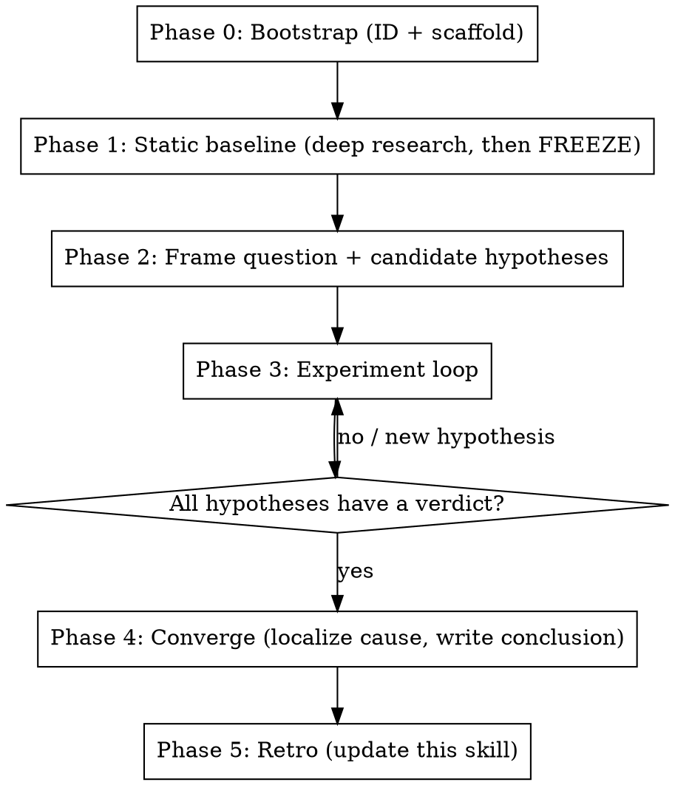

# perf-investigation

A disciplined loop for empirically localizing the cause of a performance or utilization problem when reading the code is not enough and you must run experiments. It exists to stop the failure mode of **flip-flopping between plausible fixes without ever proving where the time/cost actually goes.**

Its five non-negotiable properties (the reason this skill exists):

1. **Durable audit trail.** Every test job, every code change, every result is logged under one unique investigation ID. Nothing lives only in chat.
2. **Cumulative knowledge graph.** Findings accrete as an append-only graph of facts, hypotheses, observations, and experiments joined by `supports` / `refutes` / `motivates` / `depends_on` edges. Knowledge only grows; it is never silently overwritten.
3. **Multi-test hypothesis validation.** A hypothesis is only marked `confirmed` or `refuted` when **two or more independent tests agree AND the competing hypotheses are excluded.** No verdict from a single run. Nothing is left vague or dangling — every hypothesis ends with a verdict and its evidence.
4. **Static baseline first.** Before any experiment, deep-research an immutable baseline of the system under test and the code it runs. The baseline is frozen; changing it requires explicit user confirmation.
5. **Self-improving feedback loop.** When you learn a technique that makes the next investigation faster or safer, write it into this skill (see `LESSONS.md`).

## When to use / not use

Use it for: "why is GPU util low", "where does the step time go", "the cache didn't help — why", regressions, throughput cliffs, tail-latency hunts, memory blowups — anything where the answer is a *measurement*, not an opinion.

Do not use it for: a change whose effect is already obvious, a one-line bugfix, or a question answerable by reading one file. This skill has real overhead (baseline research, per-job logging); spend it only when the cause is genuinely unknown and getting it wrong is expensive.

## Directory layout (one per investigation)

Everything lives under `~/workspace/tmp/investigations/<INVESTIGATION_ID>/` (this base path is chosen because it persists and is not dotsync-reverted; confirm with the user if their environment differs). The ID is `<slug>-<YYYYMMDD-HHMMSS>`, generated once at the start and **carried by every job name and every artifact filename.**

```
<INVESTIGATION_ID>/
  .investigation_id            # the ID, for scripts to read
  JOURNAL.md                   # append-only chronological log of EVERY action
  baseline/
    BASELINE.md                # curated, STATIC baseline (frozen after Phase 1)
    raw/                        # raw research notes from each deep-research agent
  hypotheses/
    H1-<slug>.md               # one file per hypothesis: statement, test matrix, verdict
  jobs/
    INDEX.tsv                  # one row per test job
    <job_id>.md                # per-job record: env, config, command, raw metrics, link to hypothesis
  code/
    <job_id>.diff              # snapshot of the instrumentation/code used for that job
  results/
    <job_id>.md                # parsed result + interpretation for that job
  knowledge-graph/
    graph.jsonl                # append-only nodes + edges + verdicts (source of truth)
    graph.dot                  # rendered view (regenerated, never hand-edited)
    STATUS.md                  # rendered status: open/confirmed/refuted hypotheses
```

## Helper scripts

`scripts/` in this skill makes the logging reliable instead of relying on memory. Always route logging through them so nothing is missed. `INV=~/workspace/tmp/investigations/<INVESTIGATION_ID>`.

- `scripts/new_investigation.sh <slug>` — generate ID, scaffold the dir, print the ID.
- `scripts/log.sh <INV> "<message>"` — append a timestamped line to `JOURNAL.md`.
- `scripts/record_job.sh <INV> <job_id> <hypothesis_id> "<env>" "<config>" "<one-line result>"` — append to `jobs/INDEX.tsv` and create `jobs/<job_id>.md`. Also snapshot the current working-copy diff to `code/<job_id>.diff`.
- `scripts/kg.py <INV> node|edge|verdict|render|show ...` — manage the knowledge graph (append-only).

## The loop



### Phase 0 — Bootstrap

Run `scripts/new_investigation.sh <slug>`. Record the returned `INVESTIGATION_ID`. From here every MAST/local job name and every file you create includes that ID so the whole trail is greppable by one token. `log.sh` the framing question.

### Phase 1 — Static baseline (deep research, then FREEZE)

Before touching any knob, build the baseline. Dispatch parallel research agents (use the `deep-research` skill, or fan out `general-purpose` / `meta_codesearch:code-search` agents) covering, at minimum:

- **System under test**: the exact config/job, model shape, parallelism, batch/accumulation, hardware.
- **Code paths**: the step loop and every stage that could contribute to the symptom, with file:line.
- **Metric semantics**: for each metric you'll rely on, *what it actually measures* (read the code that emits it). This prevents chasing a metric that doesn't mean what you assume.
- **Expected/ideal behavior**: what utilization/throughput/MFU the system *should* hit if healthy, so you know how big the gap is.
- **Prior art**: RCAs, SEVs, posts, docs, recent diffs on the same area.

Have agents write raw notes to `baseline/raw/<facet>.md`, then **you** synthesize a curated `baseline/BASELINE.md`. Then **freeze it**: mark it STATIC and do not edit it during the investigation. If an experiment later contradicts the baseline, that is a *finding* (a graph node), not a reason to quietly rewrite the baseline — surface it and ask the user before changing the baseline.

Completeness matters more here than anywhere else: a wrong baseline sends the whole investigation the wrong way. Over-invest.

### Phase 2 — Frame question + candidate hypotheses

Write the precise question as a graph node (`kg.py node --type question`). Enumerate the candidate causes as `hypothesis` nodes, each `--status open`. Add `motivates` edges from baseline facts. Aim for a *mutually exclusive, collectively exhaustive* set where possible, so that confirming one and refuting the rest localizes the cause.

### Phase 3 — Experiment loop

For each open hypothesis:

1. **Design discriminating tests.** A good test changes the answer *only if the hypothesis is true*. Require **at least two independent tests** whose results, taken together, exclude the alternatives. Prefer tests that attack the hypothesis from different angles (a direct measurement + a control/ablation; or an A/B + an accounting check that must reconcile).
2. **Control variables.** Change one thing per run. Keep a baseline/control arm. Repeat a run when a result could be noise — a single number is not a measurement.
3. **Test cheaply first.** Reproduce and measure at the lowest-cost tier that still exercises the mechanism before paying for the expensive one (see `LESSONS.md` — e.g. drive the dataloader locally to avoid MAST GPU scheduling latency). Only escalate to the full/remote job when the cheap tier can't answer the question.
4. **Instrument opt-in.** Add timing/counters behind an env flag, default-off, so instrumentation never changes default behavior and every arm is comparable.
5. **Record everything.** `record_job.sh` for each run (env, config, command, raw metrics, code snapshot). `log.sh` the intent and outcome. Add an `experiment` node and `tests` edges to the hypothesis; add `observation` nodes for results with `supports`/`refutes` edges.
6. **Verdict only at high confidence.** Set `verdict confirmed|refuted` for a hypothesis **only when ≥2 independent tests agree and the competing hypotheses are excluded.** If tests conflict or a confound remains, the hypothesis stays `open` and you design another test. Never leave a hypothesis dangling: it ends `confirmed`, `refuted`, or explicitly `blocked` with the blocker named.

Reconciliation rule: prefer accounting that must sum. If you claim "X dominates the step", the measured X plus the other phases must add up to the measured step time. If they don't reconcile, you have not localized the cause yet.

### Phase 4 — Converge

When every hypothesis has a verdict and the phases reconcile, write the conclusion into `results/CONCLUSION.md`: the localized cause, the evidence chain (job IDs), and what is now known *not* to be the cause. Render the final graph (`kg.py render`). Only now propose a fix — and treat the fix as separate work (its own diffs), validated by re-running the same measurement.

### Phase 5 — Retro (feedback loop)

Ask: what would have made this faster or more certain? Append any reusable technique, gotcha, or cheap-repro trick to `LESSONS.md` in this skill so the next investigation inherits it. This is requirement #5 and is mandatory, not optional — a finished investigation that taught you nothing reusable is rare.

## Rigor rules (read every time)

- One variable per run; always keep a control arm.
- A single run is never proof — corroborate or repeat.
- Every claim in the graph or conclusion cites a `job_id` or a baseline reference.
- Optimize nothing until the bottleneck is *measured*; a plausible mechanism is a hypothesis, not a finding.
- Metrics lie until you've read what they measure. Reconcile averages against tails (avg can be hidden by buffering; the tail is often the real killer).
- The baseline is immutable without user sign-off.
- Do not add anything whose purpose is to game a utilization detector; fix the real bottleneck (see the repo's `forbid_sm_utilization_gaming` rule).
